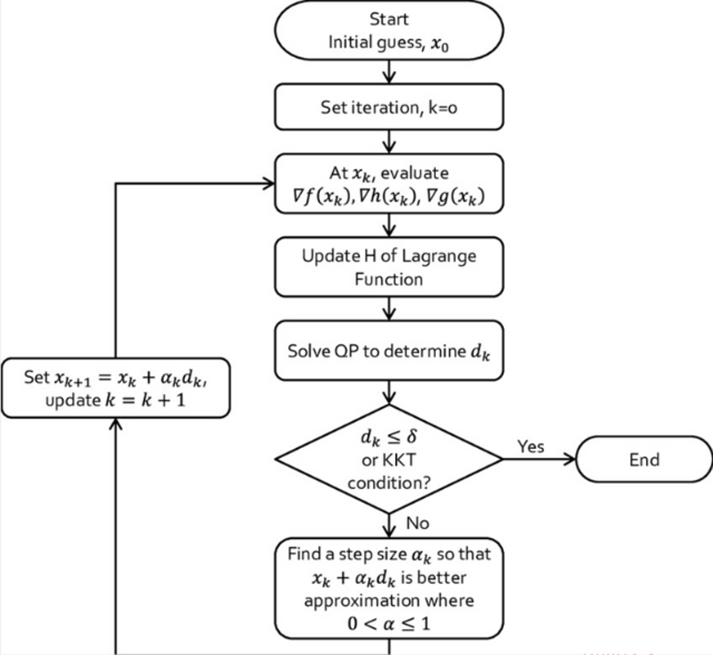
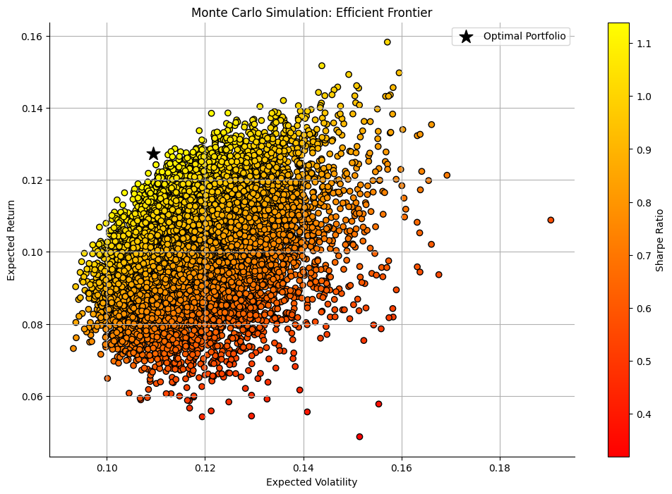
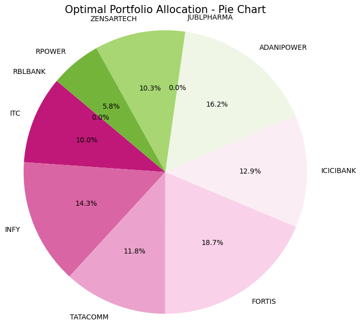
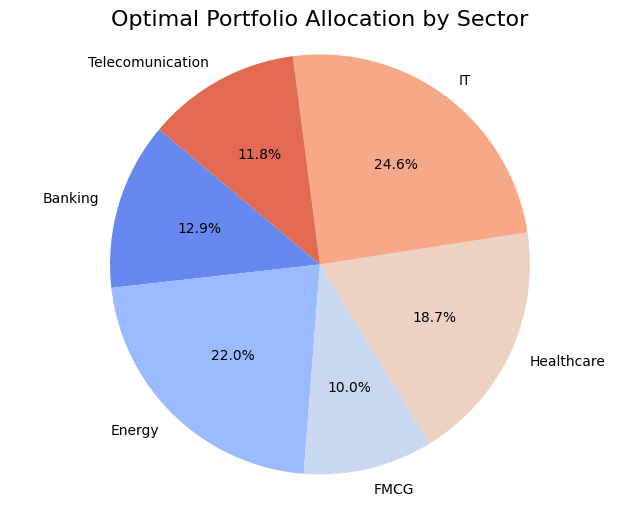
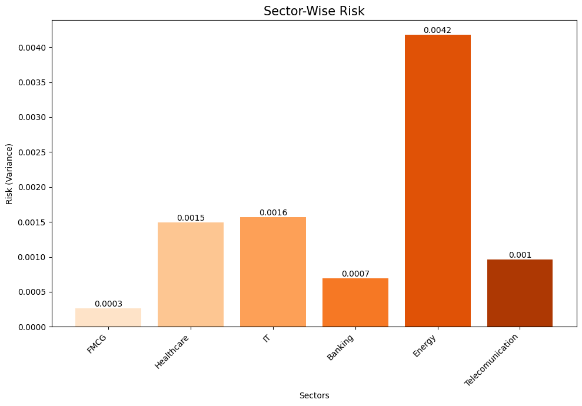
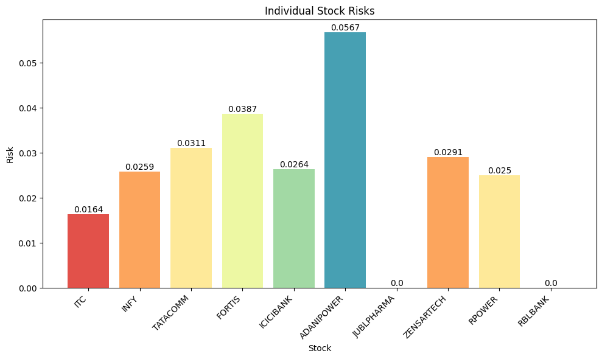

# Sharpe Ratio Optimization - Financial Portfolio Project
## 👤 Author  
**Ritam Mondal**  
Indian Institute of Technology (IIT), Kharagpur 
- Dual Degree, Industrial & Systems Engineering
- Indian Institute of Technology Kharagpur  
- connect me on:
  

    

 
  
- Email: ritamm134@gmail.com

**Under the guidance of**  
Prof. Abhishek Sharma, IIT Kharagpur     
(*I had done this project during my B.Tech at IIT kgp as an Operations Research project*)

---

you can find [shares data](data_files/shares_Data.csv) here

## 📌 Project Overview
This project implements Sharpe Ratio-based financial portfolio optimization using real Indian stock data. The model **maximizes return** per unit of risk under practical constraints such as sector allocation limits, ESG scores, liquidity thresholds, and volatility caps. The optimization is solved using **SLSQP** and visualized through **Monte Carlo** simulation and efficient frontier plots.

---

## 📈 Introduction
Financial portfolio optimization is the backbone of informed investment decision-making. Our project builds on this by maximizing the **Sharpe Ratio**, an industry-standard metric for evaluating risk-adjusted returns. Using data from Indian equities, we formulate a constrained optimization model that reflects real-world investor limitations.

---
##  Sharpe Ratio Definition

The Sharpe Ratio is a key metric used to evaluate how well an investment is performing compared to the amount of risk it's taking. It was developed by William F. Sharpe, a Nobel Prize–winning economist, and it's widely used in finance — especially when comparing mutual funds or building optimized portfolios.

In simple terms, the Sharpe Ratio tells you how much return you're getting for every unit of risk you take. It compares your investment returns to a risk-free asset like a fi xed deposit or government bond, and then adjusts that return based on the volatility (or uncertainty) of the investment. 

A **higher Sharpe Ratio** means you're getting better **risk-adjusted returns**, which is a good sign — but it also means the investment might be more volatile. So if you're targeting higher returns, you also have to be ready to handle bigger ups and downs. 
The sharpe ratio's numerator is the difference expected returns over time between realized and a benchmark such as the [risk-free rate of return](https://www.investopedia.com/terms/r/risk-freerate.asp) or the performance of a particular investment category. Its denominator is the standard deviation of returns over the same period of time, a measure of volatility and risk. For investors and fund managers, the Sharpe Ratio acts like a performance filter — helping them decide which funds are truly delivering value without blindly chasing returns that come with too much risk. It’s especially useful when comparing funds or choosing the most efficient mix of assets in a portfolio.
The objective function for optimization was defined as the negative Sharpe Ratio since [scipy.optimize.minimize()](https://docs.scipy.org/doc/scipy/reference/generated/scipy.optimize.minimize.html) minimizes functions by default.

## 🔍 Literature Review  
Rooted in **Modern Portfolio Theory (MPT)** by Harry Markowitz. It relies on mean-variance optimization—essentially balancing average returns against volatility. This work integrates extensions like:
- ESG considerations
- Liquidity constraints
- Sector allocation caps

Through bridge theory and practice by enhancing the mean-variance model to align with fund manager behavior and sustainability requirements.

---

## 🎯 Objective  
To allocate weights to a set of stocks such that the portfolio achieves:
- Maximum Sharpe Ratio or maximize net return per unit of risk taken
- Subject to constraints on sector bounds, volatility, ESG scores, and liquidity

---

## 🧮 Mathematical Model
### Objective:
   
  

### or in algebric form

### Constraints:

Used parameter In this model:

- n = number of assets in the portfolio
- μᵢ = expected mean return of asset i
- μ = Vector of expected returns of the assets
- Σ = Covariance matrix of asset returns 
- COV(i,j) = Covariance between stock i and stock j
- wᵢ = weight assigned to asset i (decision variable)
- w = vector of weight allocated (vector of decision variable)
- Rf = Annual risk free rate of return 

---

## 🧠 Parametric Grid Search (NEW SECTION)
To evaluate how varying constraint values impact portfolio performance, we performed a **grid search** across:
- Sector bounds: [10%, 30%, ..., 90%] (with UB > LB)
- Volatility caps: [1%, 6%, ..., 30%]
- ESG minimums: [35, 50, 65, 80]
- Liquidity minimums: [40k to 440k in steps of 80k]

> 🧮 *Total combinations tested: **2160***

you can find all [iteration results output](data_files/optimization_results.csv) here
            
Each combination was optimized using SLSQP, and results were stored to evaluate which constraint set gave the highest Sharpe Ratio.

📍 
**Best Optimization parameters as per Sharpe Ratio**

📍 **optimal weight allocation**

---

## ⚙️ Methodology
1. Calculate expected returns and covariance matrix from daily price data
2. Normalize and structure sector, ESG, and liquidity data
3. Define optimization problem using `scipy.optimize.minimize`
4. Solve for each constraint configuration
5. Optimization Algorithm: SLSQP (Sequential Least Squares Programming)
   - `SLSQP` is a gradient-based optimization algorithm that handles both equality and inequality constraints.
   - It solves a series of quadratic subproblems to move toward an optimum.
   - Iteratively solves a Quadratic Programming subproblem
   - Well-suited for portfolio optimization where constraints are linear or nonlinear.
   - for more info 👉🏼  [scipy.minimize(method=’SLSQP’)](https://docs.scipy.org/doc/scipy/reference/optimize.minimize-slsqp.html)

   **flow chart of SLSQP**
   
   
   

7. [Monte Carlo Simulation](https://en.wikipedia.org/wiki/Monte_Carlo_method) for Portfolio Generation and Validation
   - Generate thousands of random portfolios with varying weights.
   - Calculate expected return and volatility for each to plot the **efficient frontier.**
   - Helps validate whether the optimization results are close to the theoretical maximum Sharpe Ratio.
   - Useful for visualizing trade-offs between risk and return across many possible portfolios.
   
    

---
## 🔁 Workflow

---

## Data Insights and Optimization Results
- **Optimal Sharpe Ratio**: 1.120895
- **Portfolio Return**: 12.707%
- **Portfolio Volatility**: 11.31%

### Optimal Weights (Top 3)
- INFY: 21.93%
- ADANIPOWER: 19.01%
- TATACOMM: 12.25%
- Visualize: 
  
- **stock wise allocation** 

 

---

### Sector Allocation
- IT: 32.69%
- Energy: 25.06%
- Telecom: 12.25%
- Visualize: 

- **Sector-wise allocation**
     
 

---

## 🔎 Risk Analysis
### Sector-Wise Risk

##  Insight:

-  **Energy sector** carries the **highest risk (≈ 0.0042)**, likely due to higher volatility of its constituent stocks.
-  **IT (0.0016)** and 🏥 **Healthcare (0.0015)** are moderately risky sectors.
-  **Banking (0.0007)** and 📡 **Telecommunication (0.0010)** show lower risk contributions.
-  **FMCG** has the **lowest sector risk (≈ 0.0003)**, making it the most stable segment in the portfolio.

> This analysis provides a clear view of how each sector contributes to overall portfolio volatility, helping in risk-aware decision-making.  

**Calculated risk per sector based on variance contribution.**
             
 
                                
                              
### Stock-Wise Risk 

##  Insight:

-  **ADANIPOWER** has the **highest individual risk (≈ 0.0567)**, suggesting high volatility or a relatively large allocation.
-  Followed by **FORTIS (0.0387)**, **TATACOMM (0.0311)**, and **ZENSARTECH (0.0291)** — all contributing moderately to portfolio volatility.
-  **ITC (0.0164)** and **RPOWER (0.0250)** exhibit relatively lower individual risk.
- ⚠️ **JUBL PHARMA** and **RBL BANK** have **zero risk contribution**, aligning with their **0% allocation** in the optimal portfolio.

>  This analysis confirms that higher weights or higher variance directly increase individual stock risk, helping identify which stocks drive overall portfolio volatility.

**Breakdown of risk exposure at individual stock level.**
                                                         
                                      

---

## 🧾 Conclusion
This project demonstrates how Sharpe Ratio optimization can be used to build a realistic and robust portfolio. Incorporating ESG, sector, and liquidity constraints makes the solution applicable in real-world asset management. Our results show clear **risk-return tradeoffs** and how optimal asset allocation shifts under different scenarios.

---

##  System Configuration
- Google Colab (Jupyter notebook)
- CPU: Intel core i5-12500H, 16 GB RAM
- GPU: NVIDIA RTX 1650 Ti
  
---

## 🔗 Code & Notebook
Colab link: [Sharpe Ratio Optimization Notebook](https://colab.research.google.com/drive/1o-r-apGIyBZX_XBFFPsRV76efGEjT0kr#scrollTo=oqmwvmqaCib_)

---

## 📚 References

https://docs.quantum.ibm.com/api/qiskit/0.19/qiskit.aqua.components.optimizers.SLSQP

https://groww.in/p/sharpe-ratio

https://www.researchgate.net/publication/383713257_Impact_of_ESG_Risk_on_Portfolio_Optimization_and_Returns_An_Analysis_Using_the_Markowitz_Model

https://link.springer.com/article/10.1007/s10479-024-06189-w?utm

https://www.ijcaonline.org/archives/volume175/number34/noaman-2020-ijca-920896.pdf

https://www.investopedia.com/terms/m/modernportfoliotheory.asp

https://www.investopedia.com/impact-investing-with-a-robo-advisor-4775379

https://arxiv.org/html/2302.12291v2

https://web.stanford.edu/~wfsharpe/art/sr/sr.htm

https://market-bulls.com/max-sharpe-ratio-portfolio-optimization

https://papers.ssrn.com/sol3/Delivery.cfm/SSRN_ID4047669_code2700128.pdf?abstractid=3959708&mirid=1&type=2

Data source:

[NSE India](https://www.nseindia.com/report-detail/eq_security) 

[SPG](https://www.spglobal.com/esg/scores/results?cid=4274229)  

---

